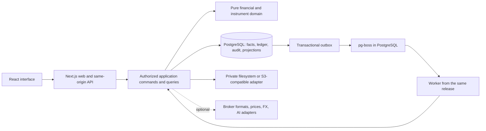

# Phase 1: Technical architecture

## Status and source of authority

Status: **Proposed architecture, documentation complete subject to review; not implemented.** Date: 2026-10-06.

This design uses [Trading_Journal_Codex_Prompt.md](../Trading_Journal_Codex_Prompt.md) in full and [the Phase 0 requirements analysis](requirements-analysis.md). It is based on the merged Phase 0 repository at `7f5f7a479ca79d1b897e1e59d9e8771b33a7f468`. The product specification remains authoritative; this architecture selects technical defaults and identifies financial-method gates without reducing product scope. The current request overrides the source prompt's instruction to implement immediately.

No application features, scaffolding, dependencies, schema, migrations, configuration files, services, or seed data are created in Phase 1. No application build/test or deployment is claimed. [ADRs](decisions/README.md) record selected decisions, alternatives, consequences and validation. [The development plan](development-plan.md) defines later work and acceptance gates; it does not authorize starting it.

## Architecture in one view

Choose a **modular monolith**: one typed domain/application codebase, a Next.js web/API process, a worker process for durable long-running tasks, PostgreSQL, and private file storage. Web and worker share a release and domain logic. No independently deployed business microservices, Redis, mandatory hosted auth, market-data feed or AI provider are needed.



Optional providers never bypass validation, authorization, source provenance or the command layer. AI receives approved aggregates/context only, not direct authority over the ledger.

## Technology selections

Versions are **compatible targets**, not installed exact pins. Read-only official package metadata/documentation was checked on 2026-10-06. Phase 2 must recheck engines/peers, select exact stable patches, commit the frozen lockfile and run compatibility checks. No prerelease is selected merely because a package's registry `latest` changes.

| Concern | Selection | Why |
| --- | --- | --- |
| Runtime/package manager | Node.js 24 LTS, pnpm 10 | Supported runtime across web, auth, jobs and tests; deterministic workspace installs |
| Language | TypeScript 5.9, strict mode | Shared compile-time contracts; compatible with selected OpenAPI tooling |
| Web/frontend/backend host | Next.js 16 App Router, React 19, Node runtime | One UI/API host with server rendering and explicit client islands |
| API | Versioned REST, Zod 4, OpenAPI 3.1, generated typed client | Inspectable external contract without coupling clients to framework/ORM internals |
| Database/ORM | PostgreSQL 17, Drizzle ORM 0.45.x/Kit 0.31.x, node-postgres 8 | Relational transactions, numeric precision, SQL constraints/locks/RLS, visible queries |
| Authentication | Better Auth 1, email/password, database-backed sessions | Local core without a hosted identity dependency; library-owned password/session mechanisms |
| Financial arithmetic | Decimal.js, branded units/currencies, decimal-string I/O | No binary floating-point accounting; reusable deterministic calculations |
| UI/components | Tailwind CSS 4, Radix primitives, Lucide, React Hook Form | Cohesive application-owned design system and accessible interaction foundations |
| Remote/table state | TanStack Query 5, compatible stable TanStack Table (currently 9) | Bounded server state and tables; no duplicate client accounting store |
| Visualization | Recharts 3 plus accessible tables | React/SVG analytics with traceable server-produced series |
| Files | Private filesystem by default; optional S3-compatible adapter | Locally runnable without a paid service; shared private storage when scaling |
| Jobs | pg-boss 12, transactional outbox, same-codebase worker | Restart-safe imports/rebuilds without Redis or distributed business services |
| Tests | Vitest (compatible stable line, currently 5), fast-check, real PostgreSQL, Testing Library, Playwright/axe | Independent economic fixtures plus relational/security/UI evidence |
| Logs | Pino structured JSON | Redacted correlation across requests, audit references and jobs |
| Deployment | OCI/Linux containers, TLS reverse proxy, PostgreSQL, persistent/private media | Vendor-neutral local-to-production path; explicit worker and storage durability |

Compatibility constraints matter: Node 24 meets Next's >=20.9 and pg-boss's >=22.12 requirements; PostgreSQL 17 meets pg-boss's >=13. Better Auth requires Drizzle ORM >=0.45.2 within the selected 0.45 line and Kit >=0.31.4. Zod-to-OpenAPI 9 supports Zod 4; openapi-typescript 7 currently peers with TypeScript 5.x. Use TypeScript 5.9 rather than blindly upgrading to registry latest. See [ADR 0001](decisions/0001-monolith-and-stack.md) and [ADR 0002](decisions/0002-contracts-and-ui.md) for official sources and tradeoffs. Patch-level compatibility still needs an actual install/build.

## Code structure and dependencies

The following is a **planned layout**, not folders created during this phase:

```text
apps/
  web/              Next routes, server rendering, client feature composition
  worker/           durable job entrypoint
packages/
  domain/           pure financial types/calculations, instrument modules
  contracts/        Zod DTO/operation schemas, generated OpenAPI client types
  database/         Drizzle schema, migrations, repository/query implementation
  server/           commands/queries, authorization, ports, adapters, composition
  ui/               shared React components and presentation helpers
docs/
  decisions/        ADRs
```

Within `domain`/`server`, use cohesive modules for identity/accounts, instruments, trading activity, ledger/settlement, inventory, strategies/risk, observations/FX, portfolio/analytics, journal/media and ingestion/reconciliation. A feature can have multiple domain concepts, but it does not get its own deployed service or arbitrary package. Broker names never define central entities or modules.

Entry points call authorized application commands/queries. Domain calculations accept explicit typed inputs and calculation/policy versions and return values or explained unavailable results; they do no DB/network/file I/O and read no ambient clock. Narrow repository/unit-of-work/provider ports permit testing. Infrastructure implements them with PostgreSQL, file, auth and queue adapters. Use explicit composition; avoid a generic repository/DI framework.

The browser imports contracts/UI, not database/server packages. `server`'s application layer depends on domain/ports; its infrastructure/composition may depend on database/providers. Enforce these boundaries with package exports, server-only imports and lint rules. Web and worker invoke the same domain handlers, validation and transaction rules, eliminating a second import-specific accounting engine.

## Frontend architecture and state

Use authenticated server components for the shell and initial bounded reads; use client components for forms, dialogs, table interaction, filters and charts. The eight suggested navigation areas map naturally to feature routes but exact ordering is a UI choice, not an architecture constraint.

Keep state responsibilities explicit:

| State | Owner | Consistency rule |
| --- | --- | --- |
| Financial facts and derived totals | PostgreSQL + server domain | Client cannot authoritatively compute/overwrite balances or P&L |
| Interactive server data | TanStack Query | Workspace/filter/revision-aware keys; invalidate after committed commands |
| Shareable account/date/currency filters | URL + validated server query contract | Same filter semantics for cards, tables, charts and exports |
| Draft form state | React Hook Form + server autosave | Versioned updates, conflict feedback, safe retry and saved-state indicator |
| Transient UI | Component state | No global accounting entity store |
| Saved views/theme/columns/timezone | Server user preferences | Persist across reloads; clear tenant caches on logout/workspace change |

Use per-request server cache/query instances for private data; disable cross-user response caching. Any future derived cache is keyed by workspace/permission, source/calculation revision, policy, filters and reporting currency. Never show a stale/rebuilding projection as a current total. Do not optimistically adjust posted cash/P&L/fill state; only reversible non-financial edits may use optimistic UI.

Tables use server-side search/filter/sort/pagination and stable cursor ordering, with 50 default/200 maximum rows. The UI owns progressive disclosure, relevant asset fields, duplicate prevention, field errors, meaningful empty/loading/error/unknown states and visible provenance. Screens and demo data must not imply unsupported native calculations.

English is initial language; labels are localization-ready and dates use locale/IANA timezone settings. Underlying decimals remain exact; display rounding never changes accounting values. Light/dark tokens, contrast, focus, keyboard operation, non-color states and responsive layouts target core WCAG 2.2 AA. Library accessibility is a starting point; Playwright/axe and manual core-flow checks remain necessary.

## Backend architecture and API

Use Next Node **route handlers** as a thin transport layer. No separate Express/Fastify service is needed. Server actions are not a second financial-command path. Server-rendered pages may call the same authorized query services directly, without HTTP to localhost.

Every command follows: session resolution → membership/action authorization → strict boundary validation → linked-object/semantic validation → transactional invariant checks → source/audit/outbox write → allowlisted response. Domain rules do not live in React components, controllers, import parsers or ORM hooks.

API contract defaults:

- `/api/v1/workspaces/{workspaceId}/...` with explicitly modeled command resources (fills, allocation/correction, cash events, imports, observations) and bounded read models (trade details, inventory, metric series). Auth routes use the library's namespace.
- Shared Zod 4 input/output schemas; reject unknown write fields. Generate OpenAPI 3.1 via `@asteasolutions/zod-to-openapi`, generate TypeScript client types via `openapi-typescript`, and use `openapi-fetch`. The contract is DTO-based rather than inferred from raw DB rows.
- All economic decimals are JSON strings; units/currency identifiers accompany them. RFC 3339 timestamps are offset-explicit. Metric results distinguish available/unavailable/undefined/infinite, carry reasons/data coverage and never serialize numeric `Infinity`/`NaN`.
- Stable problem-details/domain error codes with request ID and safe field errors. No SQL/auth/internal-provider leakage.
- Idempotency keys on financial commands, scoped to workspace/actor/operation with a request hash. Same key/body returns the committed result; reuse for a different body conflicts. Editable drafts use revisions/ETags to prevent silent lost updates.
- Bounded allowed filters/sorts, keyset cursor pagination and explicit metric population/reporting currency/as-of time. The query must not load all history into the browser.
- Heavy work returns 202/job identity. Job authorization/progress/error/commit states are separate from financial commit outcomes. Polling is sufficient initially; WebSockets are not required.

[ADR 0002](decisions/0002-contracts-and-ui.md) defines the contract and UI details.

## Database, financial correctness, and historical data

### Authoritative facts versus projections

PostgreSQL owns durable facts. Keep original plans, orders, fills, campaign allocations, posted cash events, lots/inventory, observations and account valuations distinct. Do not equate a broker snapshot, order, sale, or import row with a completed campaign. Mutable drafts/preferences coexist with immutable posted facts and published versions; this is not event sourcing every record.

Minimum logical data groups:

| Group | Entities and critical relationships |
| --- | --- |
| Identity/accounts | Global auth user/session; workspace/membership; tenant broker/account/currency; ownership on every domain record |
| Instrument reference | Instrument/identifiers, underlying links, immutable effective-dated metadata versions; quote/settlement/collateral currency and units |
| Intent and execution | Campaign, plan revisions/frozen original, leg, order, fill, conserved fill-to-idea allocations |
| Ledger/events | Cash event/posting, transfer, actual conversion, fee, dividend, interest, withholding, funding, borrowing, corporate action; source-fill and correction links |
| Holdings/observations | Lot/inventory lineage, price/FX observation, account valuation, reconciliation; original input and calculation version |
| Strategies/risk | Strategy/version, setups/rules/checklists, typed custom parameters, risk policy/version, manual/automatic/unknown assessment |
| Review/media | Journal, review/template, goal/mistake/action, tags, attachment metadata/links, custom field definition/value |
| Ingestion/audit/jobs | Template/mapping, batch/source file/row/error, broker identity/fingerprint, correction/audit, command idempotency, source revision/outbox/job |

Tenant domain keys are `(workspace_id, id)` using UUIDv4. Tenant foreign keys include workspace identity. Global auth tables and membership bootstrap use separate access rules. Relational keys/amounts/version links are columns; validated versioned JSONB holds extensible subtype/rule/mapping payloads. Private source/media bytes stay outside SQL, with hashes and state in SQL.

### Numerical and ledger rules

- Use Decimal.js with a selected 160-significant-digit calculation context and explicit HALF_EVEN rounding at documented boundaries; PostgreSQL `NUMERIC(78,36)` for canonical source economic values. Validate and reject unsupported precision/overflow before DB coercion, retaining original text/precision for import review. Calculations/storage never use JavaScript numbers for accounting.
- Brand quantity/unit, money/currency and rate direction. Metadata snapshots supply multipliers, price conventions and settlement behavior; cannot multiply incompatible units and call it cash.
- Use a cash/control journal, **not a jurisdictional tax general ledger**. Each posted event balances separately per currency. Control postings explain the counterpart; holdings/lot basis remain distinct, and control accounts are not summed as account cash/equity.
- Actual conversion posts separate conserved source/destination currency legs with recorded amounts/rate and fees; reporting translation does not move cash. Futures notional is not a purchase debit; event-specific handlers govern premiums, variation margin, collateral, accrued interest and funding.
- Dependent source fills, allocations, costs, postings, audit, invariant-critical inventory state, revision and outbox commit atomically. Lock relevant aggregate rows in a consistent order; re-evaluate from canonical sources where projections are stale. SQL constraints/deferred checks supplement application invariants.
- Published/posted history is append-only under the runtime role. Correct with reversal/replacement/supersession links, reason/actor/economic/recorded time, and affected-slice recomputation. Setting/price/rule changes never silently rewrite old facts.

[ADR 0004](decisions/0004-financial-kernel-and-ledger.md) and [ADR 0006](decisions/0006-postgres-drizzle-and-migrations.md) define this boundary. Detailed posting fixtures and metric definitions are later financial-feature gates, not invented application results.

### Campaigns, lot attribution, strategies, and risk

Account/instrument lot consumption is distinct from allocating economic activity to decision-making campaigns. A source fill's quantities and every fee-currency component are conserved across allocations plus an explicit unassigned residual. A multi-leg campaign may contain several instruments. FIFO is the initial account/instrument lot-policy default; eligible average cost and explicit allocation have versioned policies and must be validated before use. Internal transfers preserve lineage and do not become consolidated external flows.

Model lifecycle separately from data completeness and reconciliation. Default renewed activity after closure creates a linked new idea; a configured explicit reopen policy must retain prior revisions and define statistical treatment. Close only according to the recorded completion policy, not because a sell occurred. Plans/strategy/setup/rule/metadata references freeze before applicable activity; later edits append versions. Retrospective plans remain labeled retrospective.

Risk evaluates applicable account **and** strategy policies; a strategy cannot relax an account restriction. Actual fills are recordable even if they breach risk rules: assessments inform and explain, not falsify history. Original initial risk remains immutable for historical R; added risk is separately recorded and disclosed. Missing risk/inputs yield unavailable/unknown. Typed configuration supports numeric/boolean/text fields and vetted automatic predicates; no arbitrary user JavaScript/expression execution. [ADR 0005](decisions/0005-versioned-domain-and-multicurrency.md) records defaults and remaining definition gates.

## Asset-class independence and multi-currency

Instrument modules declare subtype metadata schema, validator, quantity/price/unit conventions, event handlers, cash-flow/valuation/sizing methods, and required fixture/capability versions. Broker-format adapters normalize into this model and cannot choose accounting rules. Registration is code-vetted server-side initially; no user-code plugin runtime is needed.

Capability is **per operation**, not one blanket supported flag: recording, settlement, valuation, P&L, sizing, exercise/funding/accrued-interest behavior can differ. Each result records calculation/manual/broker source, definitions, completeness, timestamp and unsupported reason. Level 1 is test-validated native behavior, level 2 is analysis with explicit compatible broker/manual values, level 3 explains unsupported automatic results while allowing safe recording/manual settlement. No level permits fake results or omitting required workflows.

All named families remain in the delivery plan: stocks/ETFs/products/funds; crypto spot/tokens/rewards; FX; futures/rolls; linear/inverse perpetuals/funding; multi-leg options; bonds/bills; leveraged OTC; warrants/turbos/factor/structured; commodities/custom. The first native financial increment targets ordinary validated equities/ETFs and crypto spot. Others get working record/import/review/manual settlement paths, then validated native modules in stages. Acceptance still includes option settlement, futures/perpetual funding, fixed-income conventions and custom unavailable metrics at declared levels.

Accounts have a base currency plus balances in multiple currencies. Workspace reporting currency is a view parameter. Preserve actual conversion events and each cost's charged currency, and retain immutable historical price/FX observations with timestamp, pair direction, source and status.

Use transaction-anchored reporting attribution: translate native trading results at realization/mark context and separately expose the difference attributable to original-basis FX, cash FX and costs. This design must be completed with reconciling multi-lot/conversion-fee fixtures before implementation of reporting totals. Changing current rates/reporting currency adds another view rather than replacing historical inputs. No missing FX/price/basis may silently become zero or a fabricated consolidated total; display explained partial coverage only if clearly labeled.

Analytics use the central dictionary specifying campaign/lot/fill/account/portfolio populations, interval, costs, currency and inputs. Cash-flow-adjusted performance is distinct from raw NAV; no deposit-driven recovery, summed percentage/R portfolio returns, or partial ideas hidden in completed-trade counts. TWR/MWR/MAE/MFE require data-sufficiency/solution criteria; optional Sharpe/Sortino/benchmarks remain optional. Broker/manual totals may be compared but not silently combined with incompatible internal definitions.

## Authentication and authorization

Choose Better Auth email/password with database sessions, secure HttpOnly same-origin cookies and the library's verified password mechanisms. Public signup is disabled by default; initial owner creation is an operator-only supported provisioning command. Local core requires no OAuth/SMTP subscription. Production password recovery/email verification require configured mail or a documented secure operator fallback; never pretend delivery works without it.

Expose a route-specific authentication gateway around supported library handlers/APIs, not an unfiltered catch-all. Better Auth's default sign-in/session JSON may contain tokens/internal fields. The gateway preserves status and every individual `Set-Cookie`/required header while returning only explicit safe user/session DTOs. The browser uses the application auth contract; server authorization uses the library's server session API. Self-session revocation accepts an owned safe session ID and resolves any required token on the server. Integration tests must prove cookie-based login/logout/revocation still work and response bodies never reveal session tokens.

Use one personal workspace initially and a backend membership/capability model for owner/editor/viewer without requiring invitation/collaboration screens. Tenant access is always authorized on the server, including jobs, exports, source bytes and attachment delivery. Auth tables/connection privileges are narrow and separate from tenant SQL. Runtime tenant roles use transaction-local context with RLS defense in depth; migrations use another role. Never trust a client workspace header alone or pooled previous context.

Session hard expiry, revocation/freshness, CSRF/origin checks, rate limits and public auth-response filtering are specified in [ADR 0003](decisions/0003-authentication-and-tenancy.md). Browser cache invalidation on session/workspace change is mandatory. Secrets/session tokens and internal auth rows must not be embedded in public DTOs or logs.

## File storage, imports, jobs, and restoration

### Private files

Default to a persistent private filesystem directory outside the public web tree. Use a narrow storage port for staging, checksum verification, promoted immutable objects, authorized reads and cleanup. Optional S3-compatible private storage supports shared media with multiple replicas; no particular cloud vendor is required.

Validate byte limits, MIME/signature and allowed types; safe image/PDF rendering and authorized download are separate from trusting extension text. Initial defaults: 20 MiB per attachment, 100 MiB per source file, 100,000 source rows, 1 GiB total expanded restore. Allow JPEG/PNG/WebP/PDF attachments; no HTML/SVG execution. Source CSV/JSON remains preserved privately, not treated as a displayed document or executable instruction. Backups/exports have injection-safe presentations without destroying original provenance. Limits are reversible configuration choices, not source-specified financial restrictions.

DB metadata tracks staged/quarantined/available/deleting states, hash, size and ownership. Because filesystem/S3 and SQL cannot share a transaction, staged immutable bytes precede committed references, with retryable promotion/outbox and orphan cleanup. No successful attachment state appears until bytes are available and authorized. Never give a public bucket/key as the storage contract.

### Durable worker and projection consistency

Use pg-boss in PostgreSQL for import parsing/validation, approved bounded commits, large exports, backup/restore staging, cleanup and historical recomputation. Keep ordinary financial writes and invariant checks synchronous. One worker process also drains the transactional outbox; domain transactions never dual-write SQL and a separate broker.

Delivery is **at least once**. Handlers use stable event/job identity, idempotent effects, bounded retries/timeouts, checked current authorization and explicit failure/retry states. Initial concurrency is two jobs with one financial commit per workspace. Cancellation stops between safe chunks; it cannot silently roll back already committed facts. Queue schema migrations/grants are controlled separately from workers.

Projections key source revision, calculation/module version, policy/reporting currency and filter context. Build candidates from a consistent source snapshot, publish only if the required current revision still matches, and never let an older job overwrite a newer projection. Queries expose stale/rebuilding status or calculate a bounded current view. Job progress does not imply reconciled data. See [ADR 0007](decisions/0007-private-storage-and-durable-jobs.md).

### Import and backup semantics

CSV is staged → mapped/normalized → dry-run validated → reviewed → committed. Retain raw rows, source hashes and stable broker IDs or documented account/broker-scoped fingerprints. Match fill-generated cash references before posting. Identical data is a no-op; changed data is a reviewed correction. Commit dependent row groups atomically; users can explicitly choose a reviewed valid subset rather than accepting silent partial writes. A batch records included/failed groups and supports dependency-aware reversal. Position-only rows become explicit opening-lot events or reconciliation observations, never invented historical fills.

Workspace backup is versioned JSON plus an optional bundled private-media/source-file manifest and hash-verified objects, required for a complete media-inclusive backup. Preserve all canonical facts, versions, provenance, audit and calculation identifiers, with derived totals as verification outputs. Restore stages into a **new empty workspace namespace**, preserves domain IDs and relations, deliberately rebinds the authorized owner and retains original actor/source provenance without importing credentials, active sessions or permissions. Existing-workspace merge/overwrite is not an initial supported restore mode. Verify compatible calculation/schema versions and regenerated totals before exposing the restored workspace. A JSON metadata-only export must disclose missing media and cannot claim complete media restore.

## Testing, operations, and delivery environment

### Test architecture

Vitest/fast-check cover pure financial units and invariants using independent hand/official fixtures. Vitest integration uses real PostgreSQL for transactions, constraints, locks, RLS, import correction/outbox and migrations. Testing Library covers relevant forms/unknown states. Playwright/axe covers user journeys, cross-user isolation, restart persistence, upload/export/restore and responsive/keyboard behavior. Capability claims map to all AC-01–AC-16 scenarios. Mocks are appropriate for provider failures, not substitutes for ledger/database validation.

ESLint (direct CLI), strict TypeScript, Prettier, package-boundary checks, OpenAPI/client drift and Next/worker builds run in future CI with frozen installs. Phase 1 checks only documentation/source coverage and links/consistency. [ADR 0008](decisions/0008-testing-and-operations.md) and the [development plan](development-plan.md) define evidence and future commands.

### Logging, configuration and secrets

Pino structured logs allowlist operation/request/job IDs, pseudonymous actor/workspace, timing/counts and revision/calculation versions. Redact passwords, tokens, cookies, authorization headers, environment secrets, notes, file/source contents, financial payloads and SQL parameters. Audit records are distinct durable facts, atomically written and authorized. Expose safe liveness/readiness, schema checks, worker heartbeat/job lag and useful user errors.

Validate server config with Zod at startup; fail closed for invalid production origins/storage/keys. Separate private config from browser-safe flags. Document future `.env.example` names/defaults only: tenant/auth/job DB URLs, migration URL for tooling only, auth secret/base URL, allowed origin, storage driver/root, limits, log level and optional provider/mail/S3 settings. No credentials or configuration files are created now. Production injects secrets at runtime and uses least-privilege roles, rotation and TLS-verified outbound clients. Core startup cannot require optional provider credentials.

### Local development and migrations

Phase 2 will supply Node 24/pnpm pins, frozen installation, PostgreSQL 17 Docker Compose with persistent volumes, private local media, separate test DB and a single command starting web plus worker. A fully containerized app option shares the same interfaces. Setup explicitly runs reviewed migrations and owner provisioning; demo seed is isolated and real workspaces start empty. Existing checkouts are used; no new Git worktree is required.

Drizzle generates candidate migrations; developers review committed SQL for financial constraints, RLS, metadata policies and data transforms. A one-off migration runner holds a deployment lock with dedicated credentials. Web/worker never auto-migrate or use schema `push` in shared/production environments. Auth/queue upgrades are coordinated in release migrations. Use expand/backfill/contract, compatibility checks and tested restore for destructive recovery, with no automatic financial history rewrite.

### Production strategy and performance

Use a Linux OCI image/release for web and worker, TLS reverse proxy, PostgreSQL and persistent private media. A single host may use local files; multiple replicas require shared private S3-compatible storage and shared PostgreSQL-backed session/rate-limit state. Releases run compatible one-shot migrations, readiness-gated rollout and graceful worker shutdown. Edge-only/serverless ephemeral-file assumptions are deliberately excluded. No public deployment is executed or authorized by this phase.

Proposed initial budgets on 4 vCPU/8 GiB: 1 million fills, 2 million postings, 100,000 campaigns/100,000 observations, 10 interactive read sessions plus one bulk job; p95 50-row lists <=500 ms, bounded summaries <=1 s, browser useful data <=2 s; 50,000-row validation/commit <=120 s excluding human review; million-fill rebuild <=10 min with bounded memory. These are unmeasured engineering targets. Measure query plans/job contention before adding caching/partitioning/services.

Protected daily backups/30-day retention and initial RPO <=24 h/RTO <=4 h are proposed operational targets, requiring restore drills before a readiness claim. Coordinate database and private-file snapshots, retain immutable audit/source history, and use PostgreSQL WAL/PITR for tighter recovery needs. Log retention starts at 14 days. The application export/restore test does not alone validate host disaster recovery.

## Resolution of Phase 0 decisions and remaining gates

The historical requirements analysis intentionally chose no architecture. This phase selects the following defaults; **proposed** means designed, not user-approved, installed or validated as software. Remaining gates require definitions/fixtures before the relevant feature increment, and do not justify starting features in this phase.

| Phase 0 decision | Phase 1 resolution | ADR / remaining feature gate |
| --- | --- | --- |
| D-01 stack/boundaries | Next modular monolith, compatible TS/Node/pnpm, explicit REST/Zod, PostgreSQL/Drizzle and selected UI tools | 0001, 0002, 0006; exact patches/install/build in Phase 2 |
| D-02 tenancy/auth | Personal workspace initially; owner/editor/viewer backend scope; Better Auth DB sessions, global auth versus tenant data | 0003, 0006; provisioning/membership/RLS integration tests |
| D-03 ledger | Currency-by-currency cash/control postings, append-only corrections and source links | 0004; event posting/settlement fixtures before ledger features |
| D-04 precision/time | Decimal strings, Decimal.js 160, NUMERIC(78,36), HALF_EVEN boundaries, preserved source time/precision | 0004, 0006; exact rounding/calendar fixtures |
| D-05 instruments | Effective-dated immutable metadata and per-operation vetted modules/manual capability | 0005; subtype schema, official formula/event fixtures and support matrix |
| D-06 lifecycle | Distinct campaign lifecycle/completeness/reconciliation; linked-new-idea closure default | 0005; completion/reopen transition fixtures |
| D-07 allocation | Conserved fill/cost partitions, separate campaign versus inventory attribution, source locks | 0004, 0005; fee/short/zero-crossing/transfer fixtures |
| D-08 lots/openings | Account/instrument policy, FIFO default, eligible average/explicit modes, explicit unknown basis and opening observations/events | 0005; per-family eligibility and version/change fixtures |
| D-09 FX | Separate real exchanges and transaction-anchored reporting views with FX decomposition and immutable references | 0005; reconciling AC-01 dictionary/fixtures before totals |
| D-10 strategy/rules | Published versions, frozen original plan, retrospective labels, typed fields and vetted predicates | 0005; rule grammar/unknown/data dependency definitions |
| D-11 risk/R | Applicable restrictions all evaluated; actual activity recorded despite breach; immutable original risk plus separate additions | 0005; sizing/risk calendars, R and multi-leg scenario fixtures |
| D-12 metrics | Central versioned dictionary; explicit populations/series/currency/availability, server-derived results | 0005, 0008; TWR/MWR/drawdown/MAE sufficiency definitions |
| D-13 recomputation | Atomic facts/revision/outbox, synchronous invariant checks, revision-keyed async projections | 0004, 0007; concurrency/retry/CAS fixtures |
| D-14 ingestion | Staging/dry run/review/group atomicity, scoped identity, correction/reconciliation and safe reversal | 0004, 0007; normalization/fingerprint/tolerance/dependency contracts |
| D-15 files/restore | Private local/S3 port, hash staging, versioned backup into new workspace namespace preserving domain IDs | 0007; limits/security/file fidelity and restore evidence |
| D-16 query/scale | Bounded REST/cursors/SQL indexes, measured proposed budgets, worker for bulk work | 0002, 0006, 0008; measured seeded query/job budgets |
| D-17 operations | Container/local topology, validated private config, Pino, protected health, controlled migrations/backups | 0006–0008; actual runbooks and recovery drills |
| D-18 UI | Server components/client islands, shared filter contract, TanStack state, Recharts/table alternative, accessibility checklist | 0002, 0008; desktop/mobile and WCAG evidence |
| D-19 integrations | Manual core first; broker/data/AI/tax adapters optional, no named provider or live connection | 0001, 0005, 0007; samples/credentials/consent only when pursued |
| D-20 testing | Independent domain fixtures, real PostgreSQL, Playwright/axe, scenario capability matrix | 0008, development plan; executable harness in Phase 2 |

No external credential, hosting decision or broker selection blocks this architecture phase. Detailed tax-jurisdiction behavior, optional providers, benchmark/risk-free assumptions and live integration permissions remain outside core scope. The next work is the documented scaffold/schema/fixture gates **only after a new implementation instruction**.
