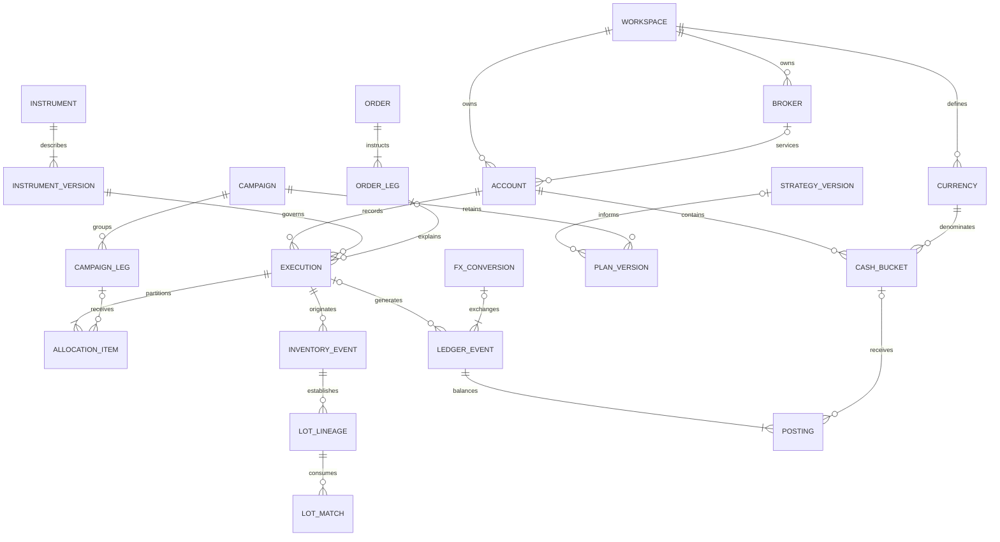

# Financial domain model

## Authority, scope, and status

Design version: `domain-v1`. This is Phase 2 documentation, to be reviewed before implementation. The [product specification](../Trading_Journal_Codex_Prompt.md) is authoritative; [Phase 0 requirements](requirements-analysis.md) supply stable requirement and acceptance identifiers. The approved [Phase 1 architecture](architecture.md), particularly ADRs [0004](decisions/0004-financial-kernel-and-ledger.md), [0005](decisions/0005-versioned-domain-and-multicurrency.md), and [0006](decisions/0006-postgres-drizzle-and-migrations.md), sets the technical boundaries.

The Phase 3 scaffold was reverted at the user's request. This checkout contains documentation; it has no application, database schema, migrations, or runnable financial tests. No native instrument capability is validated by the existence of this design.

Read this model with the normative [calculation contracts](financial-calculations.md), [instrument capability design](instrument-capabilities.md), and [independent examples and planned tests](financial-fixtures.md). The model defines logical entities, relationships, states, and invariants. Future reviewed Drizzle/SQL migrations implement these constraints; this document does not create a database.

## The twelve concepts that must remain distinct

| Concept | Meaning and scope | Example | Financial authority |
| --- | --- | --- | --- |
| Account | A custody/accounting scope owned by a workspace, with its own cash and inventory | A margin account at a broker; a paper account | Scopes facts; base currency does not restrict balance currencies |
| Broker | A service/counterparty relationship independent of strategies and accounting formulas | Two accounts at the same broker | Identifies source/custody; adapter formats do not decide economics |
| Currency | A defined monetary/settlement unit | EUR, USD, a specifically identified collateral token | Gives amounts units, precision policies, and FX pair identity |
| Instrument | A stable economic asset or contract, with immutable economic metadata versions | A listed share, a particular option expiry/strike, an inverse perpetual | Defines quantity, price, settlement, and calculation capabilities |
| Cash Movement | A classified actual monetary effect represented by a balanced ledger event | Deposit, fee, dividend, settlement, transfer leg | Cash postings are authoritative for native balances |
| FX Conversion | An actual exchange of two monetary units with recorded source/destination amounts | EUR 1,000 exchanged for USD 1,250 | Creates native cash effects; distinct from reporting translation |
| Order | A recorded instruction and its amendments/status evidence | Buy 10 shares; canceled after 3 filled | Intent; creates no inventory or cash merely by existing |
| Execution | An actual fill with account, instrument, side, quantity, price, and source evidence | Three shares filled at USD 100 | Source for inventory, applicable settlement, and costs |
| Trade | A trading idea/campaign, the decision and review unit | A multi-leg thesis using two accounts | Analytical attribution; does not own a second copy of account holdings |
| Position | Net inventory in a compatible account/instrument holding book at a source revision | Remaining 6 shares | Rebuildable current state; broker snapshots are separate observations |
| Lot | An acquisition/opening lineage slice with quantity, basis, costs, and consumption history | 2.5 shares acquired in one fill | Derived inventory lineage with immutable originating facts |
| Strategy | An account-independent playbook with published versions and setups | A breakout strategy, version 3 | Binds plans/rules/risk assessments; does not change source fills |

An account can contain unclassified activity. A campaign can contain several legs, instruments, and accounts. An execution can serve several campaigns. A canceled order can have earlier actual partial fills. A flat position does not automatically close a campaign.

## Ownership, identities, primitives, and time

### Shared record contract

Every tenant entity has `(workspace_id, id)` identity using UUIDv4 IDs. Every tenant relationship includes `workspace_id`; a valid UUID in another workspace is not a valid reference. Human labels, symbols, broker IDs, and import fingerprints are alternate identifiers. Global authentication users/sessions and workspace membership bootstrap follow ADR 0003's separate access boundary.

All durable records carry creation/recorded time, actor or retained source-actor provenance, origin (`manual`, `import`, `broker`, `provider`, `calculated`), and applicable source references. Editable drafts carry an optimistic revision. Posted/published facts carry their command identity, financial source revision, and correction/version relationships. `archived_at` prevents new selection while retaining referenced history. Archive does not reverse economics. Referenced financial records are never cascade-deleted.

Common provenance is a logical reusable record/value object, not a requirement to put every field in every table. Original decimal/timestamp text, parsing conventions, original row/file, broker reference, and reviewed normalization remain retrievable. Restore preserves original actor provenance and separately records the actor performing restoration.

### Units and precision

| Primitive | Contract |
| --- | --- |
| Decimal | Bounded canonical decimal string; source SQL envelope `NUMERIC(78,36)`; isolated Decimal.js context with 160 significant digits and HALF_EVEN at named derived boundaries |
| Money | Decimal amount plus currency ID; adding unlike currencies requires an explicit translation result |
| Quantity | Decimal magnitude plus versioned economic unit; direction is explicit rather than encoded by an ambiguous buy/sell sign |
| Price | Decimal plus quote currency, price convention, and quantity/contract unit |
| Rate | Positive decimal plus base and quote currency IDs; quote units per one base unit |
| Measurement | Typed scalar/unit, timestamp/context, definition version, source, and availability; percentages, R, contracts, money, and cash are distinct units |

Source precision, settlement/booking increments, derived-output quantization, and display scale are separate. Original broker-booked amounts may have higher precision than a customary fiat display scale; retain them with a verified actual-booking convention. Estimates follow the applicable versioned increment. Never truncate an actual fee to two decimals merely because it is denominated in fiat. Costs partition at a common source-representable allocation quantum with a deterministic remainder, as defined in the calculation document.

Input precision is checked **before** PostgreSQL numeric coercion. A row `CHECK` on an already rounded `NUMERIC` cannot detect lost source digits. Future persistence must restrict direct financial inserts to validated commands, and use text-input validation/restricted SQL functions or validated canonical raw-value constraints where database enforcement is needed. The database role cannot bypass this boundary by inserting arbitrary pre-cast values. Original unrepresentable inputs remain invalid review data.

### Temporal contract

Economic time and recorded time are independent. Keep UTC instants as `TIMESTAMPTZ(6)`, source timestamp text/offset/IANA zone, finer source precision, event date, actual/expected settlement dates, and observation instant. Preserve date-only sources as dates; an optional reviewed estimated instant is separately labeled. JavaScript millisecond dates must not silently discard microseconds or source sequence precision.

An `EconomicOrdering` reference stores verified broker sequence, source dependencies, precise instant where known, and any reviewed ordering decision. Equal-time/date-only events with order-sensitive inventory effects require explicit chronology or review. Stable UUID tie-breaks give reproducibility only for events whose relative order cannot affect economics; they are not proof that a purchase preceded a sale. Unresolved order-sensitive slices remain incomplete, rather than emitting an invented realized result. Date-only rates must follow a reviewed date/session policy; an end-of-day rate cannot masquerade as a known pre-fill observation.

`CalendarVersion` defines an IANA evaluation timezone, week start (Monday in v1), session boundaries and applicable holiday/source calendar. Daily/weekly risk and reporting filters use that pinned context. Display preferences do not move economic events between historical risk periods. Ambiguous DST inputs require a supplied offset or reviewed normalization.

## Relationships

The diagram shows principal relationships, not all physical tables. Allocation items belong to an immutable allocation set; an explicit unassigned item has no campaign leg. A ledger event can be a linked fee/settlement/correction event. Its postings target either cash buckets or classified controls, never both through a nullable ambiguous target. A draft campaign may have zero legs; execution-bearing campaigns require valid legs. Inventory events also originate from openings, transfers, and corporate actions without executions.

## Entity dictionary

### Workspace, brokers, accounts, and currencies

| Entity | Required logical data and relationships | Invariants/history |
| --- | --- | --- |
| Workspace | Name, owner/membership links, reporting preference versions, display/evaluation timezone, current financial revision | Personal workspace initially; owner/editor/viewer capabilities enforced by server and tenant RLS |
| Broker | Name, institution/legal identifiers where known, source namespaces, optional adapter references | Tenant-owned; manual/custody accounts may have no broker; no live credentials required |
| Account | Optional broker, name, account reference, `live`/`paper` environment, `cash`/`margin`/`other` type, `active`/`closed`/`historical` lifecycle, base-currency version, holding-book mode | Paper/live are separate consolidation populations by default; closing an account is not liquidating its holdings |
| AccountSettingsVersion | Effective interval, base currency, declared short capability, inventory policy references, eligibility and source-backed settlement settings | Prospective settings do not rewrite history; actual source activity remains recordable with discrepancies/breaches |
| Currency | Namespace/code, kind (`fiat`, `digital`, `custom`), canonical monetary-unit identity, optional ISO/chain/contract identifiers | Same label does not imply same unit; definitions are archived rather than repurposed |
| CurrencyConventionVersion | Display scale, estimate/settlement increments and rounding, source, effective interval | Actual booking exceptions require explicit provenance; no hardcoded USD/EUR enum |
| CashBucket | Account, currency, custody/subaccount identifier, category (`settled`, `unsettled`, `restricted`, `collateral_cash`) | No duplicate monetary ownership across buckets; restricted/collateral cash remains equity if economically owned |
| AccountObservation | As-of date/instant, broker source, currency/unit, measure (`margin`, `buying_power`, `cash_available`, liability, etc.), definition/freshness | Observation does not manufacture cash, reduce collateral twice, or become a universal margin formula |
| OpeningBoundary | Account, effective boundary, reviewed coverage, source/reconciliation links | Establishes starting balances/holdings only; excludes fabricated pre-boundary income or return |

Changing an account's base currency appends a convention version. Existing postings remain in their actual currencies. Consolidation explicitly selects accounts/environments; a workspace must not accidentally add demo/paper capital to a live portfolio.

### Instrument reference data

| Entity | Required logical data and relationships | Invariants/history |
| --- | --- | --- |
| Instrument | Stable economic identity, asset family/subtype, display name, lifecycle | A ticker is a label, not a primary key; incompatible contracts cannot share an identity |
| InstrumentIdentifier | Instrument, namespace, identifier, venue/chain where applicable, effective interval, source | Symbols reused over time require disambiguation; conflicting sources remain reviewed |
| Listing | Instrument, venue, trading/quote unit, symbol and effective interval | Several listings can reference one compatible economic asset; incompatible share classes/units are separate instruments |
| InstrumentVersion | Immutable metadata payload/schema version; quantity/price convention, quote/settlement/collateral currency, multiplier, increments, tick data, applicable expiry/strike/option/exercise/settlement data | Effective time and recorded time retained; execution, lot, event, and mark bind a version |
| UnderlyingLink | Versioned instrument/underlying relationship, role and ratio where applicable | Supports option/future/structured underlyings; no cyclic calculation dependency |
| CapabilityManifest | Subtype/module version, per-operation result contract, required metadata/inputs, reference and fixture identities | `designed`, `implemented`, and `validated` statuses differ; only validated operations can claim automatic support |

The [capability document](instrument-capabilities.md) defines all mandatory families, identity examples, metadata, event conventions, and native/manual boundaries. Quantity-unit changes require an explicit corporate action/unit-conversion event and a new compatibility version. Contract expiry/strike changes and futures rolls create separate instruments, rather than mutating an old contract.

`InstrumentVersion` is the model's short name for an immutable `InstrumentMetadataVersion`. `CalendarVersion` and `EvaluationCalendar` refer to the same pinned evaluation-calendar concept; physical schema naming must select one consistent form.

Digital units can be held as monetary cash or inventory. A `CustodyRepresentation` identifies the actual bucket/holding book, unit, and representation. The same token units are counted once. Converting that representation requires an explicit linked non-profit reclassification with quantity/lineage and valuation continuity; it is not a second purchase or deposit. Delivered spot FX is a conversion between cash currencies. Margin/rolling FX is a contractual instrument with its own settlement and valuation capability.

### Trading ideas, plans, orders, executions, and allocations

| Entity | Required logical data and relationships | Invariants/history |
| --- | --- | --- |
| Campaign (`Trade`) | Title/thesis, active-trading/investing classification, lifecycle history, closure-policy version, linked predecessor/successor ideas, tags/review links | Decision/review unit; strategy assignment is optional |
| CampaignLeg | Campaign, account, instrument/economic version, intended direction/role, leg label, attribution policy | One campaign can have several accounts and instruments; actual fills keep their original account |
| PlanVersion | Campaign/legs, thesis/context, setup and strategy versions, timeframe/session/regime/indicators, intended entry/stop/targets/quantity/cost/risk/reward, checklist references | Original commitment/freeze time is factual; later versions append; late plans are retrospective |
| PlanCommitment | Frozen original plan ID, actual commitment instant, actor, original-risk reference and validity | Backdating a narrative cannot make it an original pre-trade plan |
| Order | Account, source order identity, single-leg/package discriminator, optional campaign intent links | Journal instruction only; execution may lack an order if source history is absent |
| OrderLeg | Order, instrument version, direction, intended ratio/quantity and source leg identity | Single-instrument order has one leg; multi-leg package retains separate contracts and obligations |
| OrderRevision/Event | Header/leg versions, type, intended quantity, limit/stop or compatible package-price parameters, time-in-force, economic status evidence and amendments/cancellations | Retains initial and replacement instructions; never infers fill price from limit/package price |
| Execution | Account, instrument version, optional order leg and venue/listing, `buy`/`sell`, positive magnitude, price/convention, economic ordering, source identity, optional reference quote | Accepted actual fill; theoretical notional and booked settlement principal remain distinct |
| ExecutionAllocationSet | Execution, immutable version, reason/actor, source revision, partition policy | Supersedes prior allocation set; only one effective set at a revision |
| AllocationItem | Set, optional campaign leg, nonnegative quantity, close/open role when resolved, source cost portions | Assigned items plus an explicit unassigned residual equal the fill; default initial set is fully unassigned |
| CostAttributionSet | Source cost identity, attribution axis (`campaign`, `inventory`, or another explicitly named analytical view), immutable version, policy/context | Each axis independently partitions the same original; axes are alternative presentations, not additive charges |
| CostAllocation | Attribution set, target/version, original charged currency/amount, deterministic remainder data | Parts plus residual conserve per source cost, currency and axis; attribution changes never rebook cash |
| ReferenceQuote | Timestamp, source, bid/ask/reference price, units, price definition | Slippage needs a compatible contemporaneous reference; it is not another booked fee |

Orders and campaigns are many-to-many through intent links: a combined order can intend several ideas, but **actual execution allocations** determine attribution. An execution's parent order must match its account, and its referenced order leg must match instrument/side where applicable; a broker correction/replacement can explain a mismatch instead of silently rewriting the order. Source overfills, late fills after cancellation, and broker discrepancies remain actual facts with recorded exceptions. Invalid mathematical values (e.g. nonpositive quantity, undefined units) cannot be accepted as valid execution economics.

Package-level price or fee evidence cannot manufacture leg fill prices. Store package evidence and its quantity-ratio/unit definition; source leg fills or an explicitly reviewed compatible decomposition supply individual executions and cost partitions. Incomplete leg consideration leaves affected P&L unavailable. Native order recording initially needs only the single-leg path; the model retains package relationships for the mandatory multi-leg workflows.

An allocation set partitions quantities in the source direction. Allocation amounts cannot cancel opposite signs to hide over-allocation. Each cost identity/currency partitions independently. Reassignment is a new accepted allocation version with dependency replay; the execution, inventory economics, and charged cash do not change.

### Monetary events, fees, transfers, and conversions

| Entity | Required logical data and relationships | Invariants/history |
| --- | --- | --- |
| FinancialEvent | Immutable posted umbrella, event kind, economic/recorded time, account scopes, source/economic-effect identity, correction relationships | Can contain monetary and/or inventory effects; all dependent facts commit together |
| LedgerEvent | Financial event, classification, source links, state (`draft`/`posted`), correction group | Posted event has at least two postings and exact zero sum separately for every currency |
| Posting | Ledger event, currency, signed amount, **one** target: cash bucket or control classification/account | Controls explain counterparts; they are excluded from cash/NAV |
| Fee/Cost | Kind, signed charge/rebate convention, amount/currency, effective date, source, execution/event/account links | Actual charge authoritative; rebates are explicit signed costs; withholding is distinguishable from commission |
| SettlementEffect | Source event/execution, booked gross principal or module-specific cash effect, currency, expected/actual dates, settlement evidence, economic-effect identity | Fill-generated obligations and subsequent bucket settlement are not duplicated principal |
| FXConversion | Source/destination cash buckets/currencies, positive source/destination amounts, actual rate/direction, trade/settlement times, cost links | Amounts are authoritative; explicit rate is reconciled to their precision/convention; conversion does not supply every reporting rate implicitly |
| CashTransfer | Source/destination accounts/buckets, same monetary unit, amount, actual departure/receipt evidence, status and transit asset reference | No duplicate receipt; currency-changing transfer references a separate conversion |
| MonetaryTransitAsset | Transfer, economic owner/workspace, currency/amount, departure/receipt state, boundary timestamps | Once-counted receivable for documented internal cash in transit; classified controls remain excluded from NAV |
| HoldingTransfer | Source/destination holding books, unit/quantity, lot-slice lineage, departure/receipt evidence, external/internal ownership classification | Preserves basis, costs, unknown status and original historical rate references; not a sale |
| Income/CarryingEvent | Dividend, interest, staking/reward, withholding, funding, borrowing/financing, currency, gross/net relationship and attributable period | Gross income and withholding remain separate; funding can be received or paid |
| CorporateAction | Type, affected instruments/lots, effective ordering, old/new units/ratios, cash-in-lieu and cost/basis allocation references | Splits/mergers/spinoffs/exercise require validated handler or explicitly reviewed manual lineage; history is retained |

One fee exists once, even if presented on execution, campaign, ledger, and portfolio views. Execution charges and later borrowing/funding may be linked directly or attributed under a versioned policy. Unallocated costs remain visible at account level. Campaign partitions and inventory consumed/remaining partitions each conserve the source under a separate attribution axis; adding the two axes would count the fee twice. Optional conversion-cost attribution partitions the cost among campaigns plus an unassigned remainder and never subtracts it twice from consolidated profit. Planned fee schedules are separate `CostEstimateVersion` inputs; actual charges supersede estimates in actual calculations.

Posting targets distinguish economic cash assets from controls by a constrained discriminant. `unresolved_source` can balance recorded cash while explicitly blocking income/trade-profit classification. No unnamed balancing amount is allowed to conceal a variance.

### Inventory, lots, and position projections

| Entity | Required logical data and relationships | Invariants/history |
| --- | --- | --- |
| HoldingBook | Account, instrument, compatible economic-unit convention, broker segregation identifier, `netted`/`segregated` mode | Initial native model is netted; segregated broker long/short books require distinct book identity and fixtures |
| InventoryPolicyVersion | Holding book/scope, FIFO/eligible average/specific selection, effective boundary, calculation version | Prospective policy switch carries outstanding basis intact; intentional historical switch requires reviewed restatement |
| InventoryEvent | Opening, fill, transfer, corporate action, exercise/expiry or reviewed adjustment; quantity/unit changes and linked source facts | Noncash quantity effects cannot fabricate cash or prior executions |
| OpeningLot | Opening boundary, quantity/direction, known/unknown basis, optional known acquisition date/cost/rate provenance | Unknown values are nullable with reason, not zero; opening historical risk/fees are not invented |
| LotLineage | Origin inventory event/slice, parent lineage, original account/unit, acquisition ordering, instrument/policy versions | Stable source lineage survives transfers, splits and average-pool cost aggregation |
| LotSlice/CanonicalInventory | Remaining quantity, gross quote and booked-principal basis, original-currency entry-cost components, knownness, revision | Rebuildable but invariant-critical; synchronously current for accepted mutations |
| LotMatch | Closing execution slice, opening lineage slices, quantity, principal proceeds/basis, cost portions, realization time and versions | Consumes actual inventory once; closing a short differs from opening a long |
| PositionProjection | Holding book, source revision/context, signed net quantity, averages/basis, valuation and realized/unrealized results | Sum of remaining effective lots; never overwritten by a broker position snapshot |
| CampaignInventoryProjection | Campaign leg/account/instrument allocation pool, analytical matching policy, quantities/basis/results | Attribution only; references source allocations and cannot add another account asset |
| HoldingTransitSlice | Internal transfer, departing lot slices, unit/quantity, source ownership, receipt state | Once-counted owned holdings in transit; acquisition lineage/basis remains unchanged |

FIFO consumes oldest verified eligible lineage; average cost pools eligible compatible principal/cost components without erasing individual acquisition/rate/source lineage. Specific selection names valid available slices with exact quantities. Unknown-basis slices propagate unknown results; average pools retain the unknown component and cannot claim a fully known average. Short lots retain opening proceeds, signed exposure, entry costs, and covering matches rather than pretending that a short is a negative-priced purchase.

A fill crossing zero first closes existing opposite inventory, then opens the residual. Partition principal/costs between these slices exactly; no separate fabricated fill. An explicit close-only request cannot consume more eligible inventory. Genuine source activity that crosses zero is recorded with its actual new exposure and any eligibility/risk warning. Concurrent close-only commands lock/revalidate the same canonical book; stale analytics is never proof of inventory availability.

Account net quantity and analytical campaign quantities must reconcile including unassigned activity. Campaign matching v1 is FIFO within each campaign leg/account/instrument attribution pool; it does not override account FIFO. Opposing campaign claims can offset in a netted account; they are labeled analytical decision exposure rather than separately held broker long/short lots. Campaign realized results may differ from account realized results. A basis-attribution bridge explains the realized/unrealized differences; only compatible total marked results including unclassified costs can consolidate. Strategy percentages, R, and campaign realized totals are never silently substituted for account returns or account lot realization.

Changing tags/strategy assignment does not rewrite entry prices, inventory, or cash. Transferring analytical exposure between ideas requires an explicit versioned attribution handoff retaining quantity/basis/cost provenance; it is not an actual buy/sell. Initial ordinary attribution must have independent fixtures for its matching and bridge before implementation is accepted.

### Observations, reporting dependencies, reconciliation, and results

| Entity | Required logical data and relationships | Invariants/history |
| --- | --- | --- |
| PriceObservation | Instrument version, observed instant/date precision, price/currency/unit/convention, source, quality, bid/ask/path resolution where applicable | Immutable; corrected observation links supersession; current mark is not a source fill |
| FXObservation | Base/quote currency IDs, positive rate, observed time/precision, source/quality, raw precision | Pair direction explicit; actual conversion and reference market rate are separate facts |
| RateSelectionPolicyVersion | Source preference, freshness windows by operation/class, direct/inverse/path rules, manual override requirements | No unreviewed future rates/interpolation; triangulation initially disabled |
| ReportingContext | Reporting currency, as-of/interval, account population, calendar, source revision, policy/manifest versions | Every aggregate uses one coherent context; changing preference creates another view |
| TranslationDependency | Source economic amount/basis/cost or valuation, context, selected observation(s), direction/path, derived rate/version | Historical dependencies pinned; new/corrected rates create a new generation |
| ValuationObservation | Account/book scope, instant, amount/currency, definition (gross/net/clean/dirty/etc.), source/manual/internal, included components, freshness | A compatible broker total is an observation, not an unexplained override of internal NAV |
| Reconciliation | Scope, source statement/observations, economic date and source revision, compared definitions, variances/tolerances, assessments/evidence | `reconciled` is specific to source/revision; later changes mark it stale |
| CalculationManifest | Kernel, module, metric, precision, remainder, policy/schema compatibility versions and hashes | Identifies reproducible behavior; code upgrades do not relabel old calculations |
| ProjectionGeneration | Scope/context, manifest, source revision, input/dependency IDs, build/publish status, results/coverage | Atomic publish only if generation is current; stale generations cannot overwrite newer ones |
| MetricDefinition/Result | Versioned formula, population, costs/units/time/currency, sufficiency/edge rules; value/availability and source drill-down | Available zero, unavailable, mathematically undefined and infinite outcomes are distinguishable |

For v1, rates explicitly reviewed for a context take precedence, then eligible direct observations, then eligible inverse observations. Within a route, a versioned source-priority order and latest eligible timestamp give deterministic selection. Freshness windows must be selected explicitly when enabling an automatic operation; no global rate-age default is invented. Same-currency conversion is an identity dependency. Date-only selection requires an explicit reviewed convention. Triangulation requires a later validated bounded acyclic policy.

Missing costs, FX, marks, or original basis can leave some components available and others unavailable. Results carry missing-reason codes, known-subtotal coverage, source and versions. A partial subtotal cannot be labeled complete NAV or net P&L. An unexplained reconciliation difference cannot be renamed FX or trading profit.

### Strategies, risk, reviews, imports, and supporting records

| Entity group | Logical records and data | Financial boundary |
| --- | --- | --- |
| Strategy | Strategy identity/lifecycle/owner/tags; published StrategyVersion with hypothesis, markets/direction/style, timeframes/session/regime, entry/invalidation, stops/targets/scaling/management/exit, sizing/limits, checklist/documents/review schedule | Independent of broker/account; archive referenced identity; publish immutable versions |
| Setup/rules | Setup identity/version linked to strategy version; RuleDefinitionVersion with typed parameters and vetted predicate/input contract; ChecklistVersion/items | Rules and named setups differ; unsupported narrative remains manually assessable |
| Assessments | RuleAssessment with passed/failed/unknown, manual/automatic source, evidence, rule/plan/version/time; RiskAssessment with applicable policy inputs/breaches/unknowns | Missing data is unknown, not pass; actual economic records remain recordable despite breaches |
| Risk | Account/strategy RiskPolicyVersion; EvaluationCalendar; OriginalRiskSnapshot; SupplementalRiskSnapshot; scenario/manual-method definitions and inputs | Original pre-trade denominator immutable; no configured limit means no invented threshold |
| Custom fields | CustomFieldDefinitionVersion and typed decimal/numeric-with-unit, boolean/text/enum values bound to records/versions | Validated schema/predicates; arbitrary user JavaScript never executes |
| Journal/review | JournalEntry drafts/revisions, period/session preparation/reviews, ReviewTemplateVersion/Review, goals, mistakes, emotions, process-quality and improvement actions | Notes/interpretation cannot replace actual facts; retrospective history remains visible |
| Classification | Tag and tenant-scoped association; timeframe/session/regime/direction classifications with definition/source | Classification-only change does not rebook source cash or quantity |
| Private files | Attachment/SourceFile metadata, content hash/type/size/storage state, authorized typed entity links and before/during/after role | Bytes private; stage/promote/cleanup protocol; generic links require validated tenant-owned targets |
| Import configuration | ImportTemplateVersion, MappingVersion with delimiters/decimal/date/timezone conventions and reviewed symbol/unit mapping | Adapter normalizes into shared commands; cannot select accounting formulas |
| Import evidence | ImportBatch, SourceRow/raw source, NormalizedRow, ValidationError, DuplicateDecision, CommitGroup and result links | Dry run/review precede writes; dependent group is atomic; rejected/unselected groups remain uncommitted |
| Source identity | Scoped BrokerSourceIdentity/fingerprint version, source account/event type/namespace, canonical payload hash | Identical no-op; changed payload proposes correction; similar amounts alone do not establish identity |
| Corrections/audit | CorrectionGroup, exact LedgerReversal, source Supersession/Replacement, reason/actor/effective/recorded time, dependency/rebuild intent; AuditEvent | Resolve effective source versions before inventory replay; reversals do not manufacture sales |
| Commands/jobs | IdempotencyCommand, source revision, OutboxEvent, Job authorization/state, restore/export manifests | Facts/invariants/audit/outbox atomic; at-least-once job effects idempotent |
| Preferences/views | Reporting/display preference versions, SavedView/filter definition, draft autosave revision | UI settings are not economic events; financial contexts remain pinned |
| Hypotheticals | HypotheticalOutcome/Scenario with assumed fills/marks/costs, scenario method/version, plan/source comparison links and result provenance | Explicitly non-posting namespace; never enters actual cash, inventory, completion or actual-performance populations |

Use typed relational link tables for accounting-critical relationships. A discriminated entity link for notes/media/tags must validate target ownership and target existence; an arbitrary UUID plus an unchecked string is not an acceptable financial FK. Optional AI stores only explicitly selected context/consent and sourced review outputs. AI summaries cannot become posted economics or risk operands without a separately reviewed source action.

## Posting and economic-event catalogue

Amounts below are actual booked values. `+` increases the named cash asset; every displayed control counterpart has the opposite sign in that same currency. Holdings are inventory events, separate from these control balances.

| Event | Monetary postings and linked facts | Classification/valuation rule |
| --- | --- | --- |
| Opening cash/deposit | Cash `+A`, opening/external contribution control `-A` | Opening starts coverage; contribution is external flow, not trading income |
| Withdrawal | Cash `-A`, external withdrawal control `+A` | External outflow; not a loss |
| Ordinary linear buy | Unsettled cash `-P`, trade control `+P`; fill changes inventory | P is verified booked principal, not necessarily unrounded quote notional |
| Ordinary linear sell/short | Unsettled cash `+P`, trade control `-P`; fill closes/opens inventory | Principal is proceeds; realized result requires known matched basis |
| Actual settlement | Settled cash `-P`, unsettled cash `+P` for a buy obligation; opposite for sale receivable | Equal-and-opposite bucket move; no second purchase/profit |
| Fee/borrow/funding paid | Actual cash bucket `-F`, appropriate cost control `+F` | Charge currency/time retained; rebates/received funding reverse this direction |
| Dividend/interest/reward income | Cash `+I`, income control `-I`; withholding separately cash `-W`, tax control `+W` | Gross/net relation explicit; noncash rewards require inventory and reviewed income/basis convention |
| Actual FX exchange | Source cash `-S`, FX control `+S` in source currency; destination cash `+D`, FX control `-D` in destination currency; costs separate | Balance currencies independently; reference-rate conversion execution difference is a reporting attribution |
| Immediate internal cash transfer | Source cash `-A`, source transfer control `+A`; destination cash `+A`, destination transfer control `-A` | Atomic linked legs; internal only when both scopes belong to the selected consolidated owner |
| Delayed internal transfer | At departure cash decreases with transfer control; transit monetary asset established by linked state; at receipt destination cash increases and transit extinguishes | Transit asset counted once for owner-level NAV; controls never counted as receivables |
| Holding transfer/opening/split | Inventory lineage event; monetary legs only for actual fee/cash-in-lieu | No invented sale/deposit P&L; corporate-action basis treatment must be reviewed |
| Derivative premium/variation margin/funding/exercise | Capability-specific actual cash/control event plus linked exposure, accrual/settlement, or inventory effects | No full futures notional debit; no double counting settled variation margin in marked derivative value |
| Restricted/collateral cash move | Opposite postings between owned cash categories | No second asset or fee merely for restriction; liabilities/encumbrances retain explicit definitions |
| Manual unsupported settlement | Explicit actual amount/currency, financial classification, compatible observation/obligation links and source/manual verification | Recording works; automatic theoretical valuation/P&L remains unavailable without sufficient compatible data |
| Correction | Exact negation of original ledger postings plus independently validated replacement; source supersession controls replay | Bookkeeping reversal is not a new economic sell/cover; old recorded view retained |

Each effect gets a unique economic-effect identity (source event, role/component and version). An execution obligation, the actual settling bucket transfer, and a fee are different effects. An import row matching one existing effect supplies reconciliation evidence, rather than booking another debit. Corrections can replace an effect through linked versions without violating identity conservation.

For delayed transfers, account views disclose departed/receivable/in-transit/destination ownership boundaries; consolidated selection includes transit once. A selected-account subset can classify the crossing as external to that subset. External custody transfers need explicit ownership/flow valuation rather than pretending they are internal. Inventory in transit follows the same ownership principle with lot lineage. Transfer-state changes require evidence and atomic no-duplicate receipt checks.

## State models and transitions

| Aggregate/dimension | States and transitions | Evidence and exceptions |
| --- | --- | --- |
| Financial source | Editable draft → accepted/posted; subsequently corrected/superseded by linked immutable facts | No mutable posted amounts; archive is not correction |
| Order | Recorded/pending → working → partially filled → filled; cancellation/rejection/expiry events may end remaining intent | Actual fills retained; terminal intent status does not erase fills; discrepancy evidence handles late/overfills |
| Campaign lifecycle | Planned → open → partially closed → closed; planned with no executions → canceled | Open after effective allocated activity; partial after closure activity with remaining exposure; explicit closure confirmation required |
| Campaign flat-awaiting-confirmation | Presentation derived from zero remaining assigned exposure while lifecycle is open/partial | No automatic completed-trade inclusion until confirmed closure |
| Campaign completeness | Operation-specific sufficient/incomplete with reasons and import origin | Closed with unknown basis can still have unavailable P&L; absence of original risk separately blocks R |
| Reconciliation | Unassessed/variance/reconciled, plus fresh/stale relative to source revision | Correction can stale reconciliation without inventing new lifecycle |
| Transfer | Draft → departed/in-transit → received, or failed/disputed with evidence | Cancel before departure; later refund/correction is a real new event or audited restatement, not deletion |
| Strategy/instrument/policy | Draft → published effective version → retired/archived identity | New publication leaves prior references unchanged |
| Import | Uploaded → mapped → validated/dry-run → reviewed → committing → committed/partially committed/failed | Partial result states enumerate committed atomic groups; job cancellation does not undo them |
| Projection | Queued/building → ready/published; stale/superseded/failed status | Old generation cannot become current after a newer source revision |

Closure policy v1 requires explicit confirmation, zero remaining **assigned** exposure on every leg/account, and no unresolved settlement/exercise/expiry/funding obligation required by its capability. Quantities must be exactly zero under the economic-unit convention, not display-rounded to zero. Closure records actor, time, source revision, obligation evidence, and definition version. Costs discovered later may restate results without implying a new economic trade; unresolved obligations/quantities invalidate closure eligibility and flag review. Completion status is retained as history while the current classification is re-evaluated.

New activity after confirmed closure defaults to a new linked campaign. Deliberate reopening remains a schema-supported future policy gate: prior closure episodes and statistical populations must be preserved and independently tested before it can be enabled. This v1 design does not silently permit automatic reopening.

## Calculation and availability contracts

The calculation document defines versioned equations, sign conventions, rounding, fee/principal matching, native and reporting results, FX bridges, risk, and the initial metric dictionary. Authoritative inputs are immutable source facts and explicit observations, not cached browser totals.

Required financial outputs include balances by account/currency/bucket; quantity and execution-weighted average entry; gross quote versus booked principal cost basis; entry/exit/carrying costs; realized/unrealized gross/net; compatible exposure and NAV; cash/holding FX and conversion execution effects. Costs are displayed in original charged currency even when a conversion is available. Account and campaign populations, accounting realization and attribution realization, and actual versus hypothetical results stay labeled separately.

### Risk policy and predicate data contract

Each `RiskPolicyVersion` contains typed `RiskLimit` records with limit kind, operand/metric and definition version, comparison operator, configured threshold/unit, population (account/books/campaigns/instrument categories), denominator if a ratio, period/calendar boundary, gross/net and realized/unrealized basis, valuation/FX freshness policy, required inputs, and effective interval. Thresholds are explicit user configuration; empty policy means no invented numerical restriction.

| Required limit kind | Operand and data needed |
| --- | --- |
| Per-trade risk | Valid original/proposed risk in a stated currency, or its ratio to complete compatible account equity at the assessment time |
| Daily/weekly loss | A defined net period-loss measure with timezone/calendar, external-flow exclusion, realized-only or complete marked-return basis, and period reset; arbitrary lifetime P&L is not a daily operand |
| Maximum concurrent positions | Count of distinct nonzero actual holding books under the specified netted/segregated convention; campaign-count limits require a separately named operand |
| Concentration | Compatible instrument/issuer/asset/category gross or net exposure divided by complete eligible capital; direction, aggregation and denominator must be explicit |
| Leverage/exposure | Validated monetary gross/net exposure, absolute cap or ratio to eligible positive capital; no sum of unrelated quantities or generic derivatives notional-as-NAV |
| Overnight restriction | Eligible exposure intersects a prohibited session boundary in the policy's calendar; missing timezone/session evidence yields unknown |
| Prohibited instruments | Versioned instrument/category/subtype/market eligibility predicates with reviewed identities, including unsupported-operation restrictions |

Vetted predicate operators in v1 are typed equality/inequality, ordered decimal comparisons on identical units, bounded ranges, set membership, presence, and boolean AND/OR/NOT over declared operands. Their semantics use passed/failed/unknown: AND fails on an established failing clause, passes only when all pass; OR passes on an established passing clause, fails only when all fail; NOT preserves unknown. Narrative conditions remain manual assessments. No arbitrary expression text executes. Every assessment retains evaluated inputs, predicate/metric/policy versions, actor/time, source revision and unknown/breach reasons.

Loss policies must explicitly select one supported definition before activation: period realized-activity result, or complete account change net of external flows with boundary marks/FX. For the first, use gross matched realization (including realized holding FX in a reporting view) plus the explicitly included period income, less actual costs charged in that period. Do not start from fee-net lot realization and subtract those costs again. Entry expenses are recognized on their charged date for this risk measure, so it is separately labeled from campaign/lot net realization. The second is `NAV_end - NAV_start - net_external_flows` and includes all supported marked effects. The nonnegative loss operand is `max(0, -net_result)` under the selected definition. A policy may instead measure drawdown from a period opening/peak, but that is a different named measure and requires its own series. Profits offset losses only in the selected net measure; gross losing-activity caps require a separately named definition. Unsupported advanced realization or missing boundary valuations leaves that policy unknown. No silent switch between these bases.

Risk v1 applies both account and strategy policies. Compatible limits use the strictest applicable bound; prohibited predicates combine by union. Incompatible populations/units are assessed separately and cannot be silently merged. Linear sizing uses a validated stop/cost/unit formula; nonlinear products use verified scenarios/max-loss or explicit manual risk. Original risk has amount/currency/method and its commitment-time reporting dependency; R uses net campaign result and that frozen risk translated into a compatible fixed reporting unit. Scale-in/additional-leg risks are separately recorded; no historical denominator replacement. Retrospective risk cannot become original R.

Actual breaches remain recorded, while pre-trade advice can report a failed/unknown proposal. Daily/weekly loss and exposure definitions belong to the explicit versioned policies above, never to an assumed account capital or numeric limit. Broker margin and buying power are observations unless a dedicated module validates exact computation.

Available values carry unit/currency, gross/net, realized/unrealized, source revision, manifest and policy versions, observation references, population/time context, and coverage. Unavailable values carry reason codes such as `missing_basis`, `missing_fx`, `stale_price`, `incomplete_costs`, `unsupported_operation`, `ambiguous_ordering`, or `missing_original_risk`. Mathematical undefined/infinite outcomes carry their distinct state/reason; JSON contains no NaN/Infinity or unexplained null/zero.

## Command, database, and replay boundaries

1. Verify actor/session, workspace membership and action capability; resolve all related records within that workspace.
2. Validate lexical decimals, units, subtype metadata and time/source identities. Parse/import/files/providers outside the financial transaction.
3. Check scoped idempotency key and request hash; same key/body returns the original committed result; changed body conflicts.
4. Acquire workspace financial-revision lock, then affected holding-book/account/transfer/execution locks in sorted stable-key order. Every mutation uses the same order. Lock granularity may be refined later without weakening invariants.
5. Resolve effective correction/allocation/metadata/policy inputs; rebuild a stale affected canonical slice under lock or reject with an explicit rebuild conflict. Validate source quantity/cost conservation, lot eligibility, actual monetary postings, transit ownership and expected revisions.
6. Atomically commit sources, immutable versions, postings, allocation/lot changes, invariant-critical inventory, audit, incremented source revision, idempotency result and outbox intent. Deferred SQL checks/restricted functions independently enforce feasible cross-row constraints.
7. Outbox/jobs rebuild broader views from a consistent source snapshot using the same pure kernel. Publish with expected-revision/context comparison; expose stale/rebuilding results without mixing generations.

Ordinary isolation is READ COMMITTED with stable aggregate locks and revision checks; predicates that cannot be protected use SERIALIZABLE. Bounded deadlock/serialization retries preserve the idempotency identity. No financial transaction holds locks during provider requests, human review, file parsing, or broad analytics.

Persistence requires composite tenant FKs, scoped source/effect/idempotency uniqueness, positive quantity/rate and valid discriminants, precision-before-cast validation, append-only source/version permissions, balanced posted events, and allocation/transfer conservation. Row checks alone cannot enforce cross-row sums; future SQL uses deferred constraint triggers or restricted mutation functions plus locking. Runtime roles are non-owner, no bypass-RLS; transaction-local context denies access when absent. Auth/queue/migration privileges are separate.

Indexes begin with workspace and relevant account/book/instrument, then economic ordering plus ID; add source identity, event/posting, campaign allocation, version and projection-context indexes. Keyset-paginated histories and bounded aggregates avoid loading the full ledger into the browser. Physical partitioning is deferred until measured need.

## Corrections, imports, reconciliation, and portability

Correcting a fill appends source replacement and exact monetary reversals/replacements with reason and both dates. **Cash replay includes original postings, their exact negating reversals, and replacements visible in the chosen recorded/economic view. It must not discard original cash postings while retaining their reversals. Inventory replay separately selects the effective source execution versions and applies their economics once; monetary reversals are not inverse inventory trades.** Allocation-only correction changes attribution projections without cash/inventory duplication. Metadata or historical observation corrections append superseding versions and an explicit restated reporting generation. A real later refund is a newly dated receipt, not historical correction.

The dependency graph includes executions → settlement/costs → account inventory/matches → campaign attribution → reporting FX/marks → risk/metrics, plus cross-account transfers and corporate-action lineage. Recompute conservatively from the earliest affected boundary. An old projection may remain an audit artifact but cannot silently become current. Accepted corrections may reveal unknown chronology/basis or invalidate closure; the result is explicit incompleteness/review rather than invented balancing profit.

Imports preserve source file/hash/raw rows and normalized mapping versions. Source identity is scoped by workspace, account, broker namespace, record kind and source ID; fallback fingerprints retain a versioned normalized tuple and source ambiguity. Identical content is a no-op, changed source payload proposes correction, and ambiguous similar rows require review. Dry runs identify complete dependency groups. Only reviewed valid groups commit atomically; partial batches enumerate excluded/failed groups. Batch reversal reviews downstream transfers, consumption and replacements; unsafe reversal is blocked or performed as an explicit dependency-aware correction, never cascaded deletion.

Reconciliation compares like definitions at a pinned source revision: currencies/units, gross/net, settled/unsettled, accrued/clean/dirty and observation scope must match. Exact quantity/booked cash equality is v1 default; a configurable explicit source-rounding tolerance can label an accepted variance but never alter facts or imply zero difference. Missing source coverage remains unresolved. Broker snapshots become observations by default; reviewed opening mappings establish lots/balances at a coverage boundary.

Workspace backup contains canonical sources, IDs/relationships, original precision and time provenance, versions, costs, allocations, corrections/audit, observation/translation dependencies and calculation/schema manifests. Include hash-verified private-file objects for a media-complete backup. Derived outputs serve as independent verification; regenerate them with the same compatible manifest. Restore into a new empty workspace namespace, preserve domain IDs, rebind the authorized owner, and retain original source actors. Credentials, sessions and old permissions never enter portable backups. Missing code/convention versions or media block the associated fidelity claim rather than silently substituting current defaults.

## Design invariants and acceptance traceability

| ID | Invariant | Required evidence |
| --- | --- | --- |
| INV-01 | Every related tenant record is in the same authorized workspace | Composite FK/RLS/API/file/export tests; AC-14 |
| INV-02 | Every posted event balances exactly in each currency with at least two postings | Decimal/posting/property and deferred-database tests; AC-01/10/11 |
| INV-03 | Source financial numbers retain precision and units; no binary monetary intermediates | Boundary/round-trip/overflow and booking-remainder cases |
| INV-04 | Execution allocation quantity and every source-cost currency conserve, including residuals | Shared fills/reassignments/concurrency; AC-02/03 |
| INV-05 | Effective inventory is consumed once; remaining quantity and principal/cost lineage conserve | Partial/fractional/short/zero-cross/method/transfer cases; AC-02/04/09 |
| INV-06 | Orders, display settings, tags and reporting translations never manufacture money/holdings | Cancellation/late-fill/view-change tests; AC-02/12 |
| INV-07 | An economic effect is booked once through manual/import/retry/correction paths | Idempotency and settlement/fee reconciliation; AC-11 |
| INV-08 | Actual FX, historical translation, holding FX, cash FX and costs form a compatible nonduplicated bridge | Two-conversion independent example; AC-01/10 |
| INV-09 | Unknown basis/risk/FX/marks/history never become fictional zeros or passed assessments | Missing/undefined/manual cases; AC-08/09/12/13 |
| INV-10 | Posted facts and published versions remain immutable; correction replay creates no fictitious trades | Reversal/replacement/time/version tests; AC-09/12 |
| INV-11 | Internal transfer ownership/lineage/transit assets counted once; external flow classification is scope-specific | Multiple accounts, delayed transfers, subset consolidation; AC-09/10 |
| INV-12 | Native asset operations require matching validated capabilities and conventions | Official/independent derivative/fixed-income/custom fixtures; AC-05/06/07/08 |
| INV-13 | Current projections share a coherent source/context generation | Atomic publish, failed/duplicate/stale jobs and correction tests |
| INV-14 | Restore with the same compatible calculation context reproduces canonical facts and totals | Independent backup/rebuild/media/hash round trip; AC-15 |
| INV-15 | Core manual workflows have no external provider dependency and persist | Restart and provider-absent journeys; AC-16 |
| INV-16 | Closure and statistical populations follow explicit evidence, not sale counts | Multi-leg obligations, closed-incomplete, risk and partial cases; AC-02/03/12/13 |

The [fixture catalogue](financial-fixtures.md) maps all AC-01–AC-16 to expected examples and future unit/property/integration/journey checks. Design arithmetic validation does not mean these application tests have run. Phase 0 and Phase 1 consistency checks are recorded with Phase 2 in the [validation report](phase-2-validation.md).

## Decisions and gates before implementation

This v1 design resolves core entity boundaries, ownership, source-versus-derived authority, netted inventory default, campaign/account attribution separation, postings, precision, signed shorts, principal-versus-quote basis, settlement identity, transit ownership, immutable corrections, historical FX dependencies, original-risk history and unsupported-operation behavior. ADRs 0004–0006 remain the architectural authority; this document supplies their domain detail without adding a new service or changing the approved stack.

The following are concrete implementation gates rather than permission to defer mandatory product scope:

1. Review the Phase 2 model and its calculation/fixture contracts before financial implementation. Physical schema/migrations must independently enforce the stated tenant, append-only, precision, posting, conservation and idempotency constraints.
2. In Phase 3, verify exact supported dependency patches and auth gateway behavior, create the lockfile/platform harness, and pass all eight clean-environment scaffold checks. The previous scaffold was reverted; its historical results cannot certify a new checkout.
3. In Phase 4, implement and test the named ordinary-linear baseline, FIFO/eligible average/specific matching, both short and partial/zero-cross paths, all native/charged currencies, settlement principal rounding, shared-campaign attribution and the full cash/holding FX bridge. Tests must include real PostgreSQL concurrency and constraint failures.
4. Select explicit source/freshness/session policies when enabling automatic marks/rates; do not assume a universally valid age limit. Triangulation, date-only inferred chronology, segregated broker books and deliberate campaign reopening remain disabled until their separate fixtures and policies are reviewed.
5. Validate official product conventions for each advanced native module (including option exercise/assignment, futures daily settlement, inverse/funding, bond accrual and structured events). All-family recording/manual settlement remains mandatory independently of those native formula gates.
6. Before performance analytics, complete any gated solver/calendar/price-path conventions in the calculation dictionary and verify populations, availability and source definitions. A raw NAV curve cannot substitute for a validated flow-adjusted return curve.
7. Test import dependency reversal, compatible observation tolerances, source identities, portable calculation-version availability and private-media restore. Accepted variance never rewrites ledger facts. Operational recovery and measured performance need later running-system evidence.

No missing broker credentials, market-data subscription, preferred strategy, account capital or numeric risk budget blocks this model. These are explicit user data/configuration inputs, not reasons to invent defaults.
